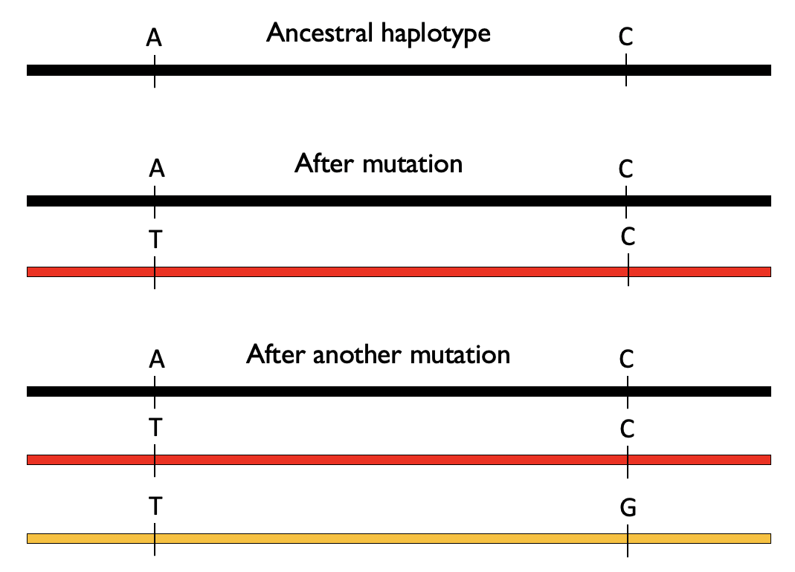

# 3.7 Recombination

We previously discussed how *mutations* contribute new genetic variants as fuel for evolution. Here we discuss another process, *recombination*, in which diploid genome copies exchange genetic material, which can result in new combinations of variants together on the same chromosome copy. Recombination is an important additional force driving changes in genomes and patterns of genetic variation over time.

## Mitosis vs. meiosis

Most cells in the human body are *diploid*, meaning they each have to copies of each chromosome (one copy from each of your parents). These diploid cells usually divide by a process known as *mitosis*, in which the entire diploid genome is copied, and a single cell splits into two daughter cells, each with an identical diploid genome to that of the original cell. (Note: they might not quite be identical. During cell division of non-germ cells, *somatic mutations* may arise. We are going to largely ignore somatic mutations in this course but there is growing appreciation of the contribution of somatic mutations to human health.)

On the other hand, *gametes* (egg and seprm) are *haploid*, meaning they have only a single copy of each chromosome. These are generated by a different type of cell division known as *meiosis*. First, similar to mitosis, a diploid cell undergoes DNA replication to make a new copy of the genome. Then, there are two separate rounds of cell division (meiosis I and meiosis II) to ultimately generate four *haploid* gamete cells.

After DNA replication but before the first division, *homologous recombination* may occur. In the figure above, black and red denote the two original copies of the genome. After recombination occurs, we still have two copies of the genome, but there has been an exchange of genetic material. The resulting chromosome copies are mosaics of the two original genome copies (red and black). 

This has important implications when we think about inheritance of genome copies. For example, this means the copy of the chromosome you received from your mom is not identical that in either you maternal grandmother or maternal grandfather, but rather is more likely a mosaic containing material from both of your maternal grandparents (and same idea for the genome copy you received from your father).

There is around one recombination event per chromosome per generation. The total number of recombination events across all chromosomes per generation is around 35.

## Recombination results in new combinations of alleles

Another important implication of recombination is that can result in new combinations of alleles. Let's illustrate that process below.

To do so, we'll introduce a new term. A *haplotype* will refer to a combination of alleles found together (and typically nearby) on the same copy of the chromosome. Consider two positions which start out as "A" and "C" on an ancestral copy of a haplotype (black haplotype below). At some point, the "A" mutates to a "T" (generating the red haplotype below). Then later the "C" at the second position on the red haplotype mutates to a "G" to create a new haplotype (orange haplotype below). In the absence of recombination, we would never observe an "A" at position 1 together with a "G" at position 2.

Now, consider that the black and the orange chromosomes undergo recombination. This can make a new combination of variants ("A" and "G") on the same chromosome copy that otherwise impossible to obtain:

This process of recombination is happening each generation, making new arrangements of variants. It is therefore an important driving force, alongside mutations themselves, of genome evolution.

Notably, recombination does not occur completely at random. Rather, there are "hotspots" in the genome where breakpoints tend to occur. In some cases, these hotspots are driven by special sequence "motifs" in the genome which may encode for regulatory proteins such as [*PRDM9*](https://www.science.org/doi/10.1126/science.1183439). The presence of these hotspots will create unique patterns of correlation across the genome which we will explore below.

## Linkage disequilibrium

Generally, two variants that are very close together on a chromosome are less likely to be broken up by recombination than those that are very far away. As a consequence, genotypes for variants that are nearby are likely to be correlated, or in *linkage disequilibrium (LD)* with each other. We will discuss several metrics to compute the LD between pairs of variants.

Consider two SNPs, SNP1 and SNP2, with MAFs $q_1$ and $q_2$. We can go observe many haplotypes in the population, and count how many times we saw each combination of alleles at these two positions. e.g. $p_{00}$ denotes the percent of haplotypes that have the major allele at both positions:

We consider the two SNPs to be in *linkage equilibrium* (uncorrelated) if the chance to observe a particular combination of alleles is the same as if we had drawn each allele independently, i.e.:

* $p_{00} = (1-q_1)(1-q_2)$
* $p_{10} = q_1(1-q_2)$
* $p_{01} = (1-q_1)q_2$
* $p_{11} = q_1q_2$

On the other hand, that are in LD if these relationships are not true:

* $p_{00} \neq (1-q_1)(1-q_2)$
* $p_{10} \neq q_1(1-q_2)$
* $p_{01} \neq (1-q_1)q_2$
* $p_{11} \neq q_1q_2$

### D and D prime

One way we can quantify LD is with the $D$ metric:

$$ D = p_{11} - q_1q_2 $$

This measures how far the observed haplotype frequencies deviate from the expected. If there is no LD, then this quantity will be 0. Note, the sign is arbitrary. A limitation of this metric is that the range depends on the MAFs of SNP1 and SNP2. Therefore a more commonly used metric is $D'$, which normalizes by the maximum possible value of $D$:

$$ D' = D/D_{max}$$

where $D_{max} = \max\{-q_1q_2, -(1-q_1)(1-q_2)\}$ if $D<0$ and $D_{max} = \min\{q_1(1-q_2), (1-q_1)q_2\} if $D>0$.

### $r^2$

Another way to measure LD is using squared Pearson correlation between the alleles at SNP1 vs. SNP2 across many haplotypes in the population. This comes out to:

$$r^2 = \frac{D^2}{q_1(1-q_1)q_2(1-q_2)}$$

$r^2$ is between 0 and 1 (although it is not always possible for $r^2$ to reach 1, depending on the allele frequencies of the two SNPs considered). It will also be a convenient metric later on when we talk about GWAS and fine-mapping.

