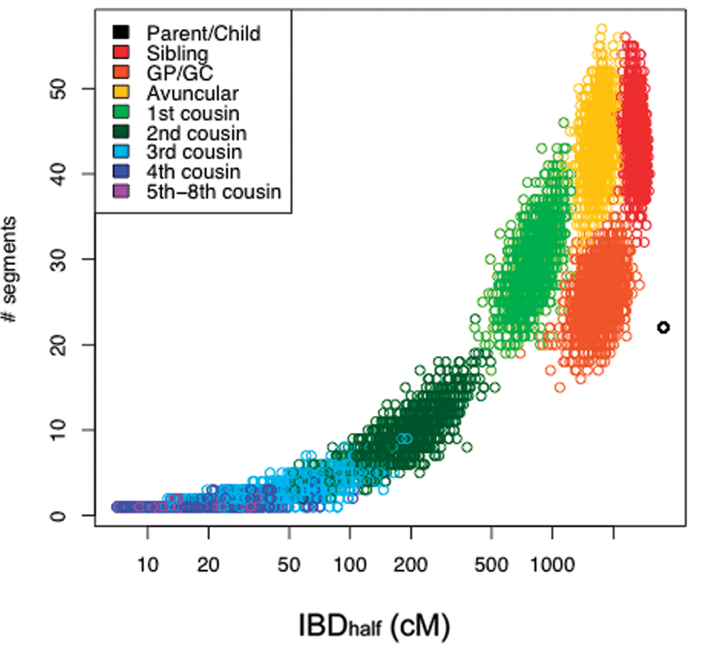

# 5.4 Computing expected IBD segment sharing

In the previous section, we used the *percent of the genome* shared at different IBD levels (0, 1, or 2) to infer familial relationships. There is another source of information we could use, which is the *number* and *length* of distinct shared IBD segments.

Generally, we expect IBD segments to be large for closely related individuals. In the most extreme case, parent-child pairs will share each entire chromosome at IBD=1. For more distant relatives, shared segments will be shorter, since each generation (each meiosis event) each chromosome will undergo around 1 recombination event, which will break down the segments.

The plot below from 23andme beautifully shows how different relative pairs will have characteristic length and number of shared segments:

Source: https://journals.plos.org/plosone/article?id=10.1371/journal.pone.0034267

## Expected number of segments

Let:

* $r$ be the number of recombination events per meiosis. This is estimated to be around 35.
* $c=22$ be the number of autosomal chromosomes
* $d$ be the number of meiosis events in a path between relative pairs
* $a$ be the number of shared ancestors for a pair of relatives (1 or 2)

Then the expected number of shared segments for the relative pair is:

$$E[segments] = a \frac{rd+c}{2^{d-1}}$$

* The $rd+c$ is because every meiosis event is adding $r$ new additional segments (by breaking up the previous segments)
* Multiply by $a$ because if 2 relatives are shared, there are twice as many possible segments that can be shared
* Divide by $2^{d-1}$ since every meiosis event there is a 50% chance that a particular segment is lost.

Working this out we get:
* For siblings: $d=2$, $a=2$, we expect around 92 segments
* For grandparent/grandchild: $d=2$, $a=1$, we expect 46 segments
* For avuncular: $d=3$, $a=2$, expect 63.5
* For first cousin: $d=4$, $a=2$, expect 40.5
etc.

Note the observed numbers of segments in the 23andme plot above are less than that. This may be because short segments cannot be reliably determined as IBD and are not considered.

See also [this helpful blog post](https://gcbias.org/2013/12/02/how-many-genomic-blocks-do-you-share-with-a-cousin/) which gives further description of the expected number of shared segments.

## Expected length of segments

See the [ERSA](https://pubmed.ncbi.nlm.nih.gov/21324875/) paper for more info on this.

The length of shared segments is exponentially distributed, with a mean length depending on the relationship between individuals (mean around $100cM/d$, where $d$ is the number of meiosis events).

## Detecting shared IBD segments

We do not go in detail into algorithms for detecting shared segments, but two commonly used approaches are:

* [GERMLINE](https://github.com/gusevlab/germline2)
* [Beagle](https://faculty.washington.edu/browning/beagle/beagle_4.1_21Jan17.pdf)
