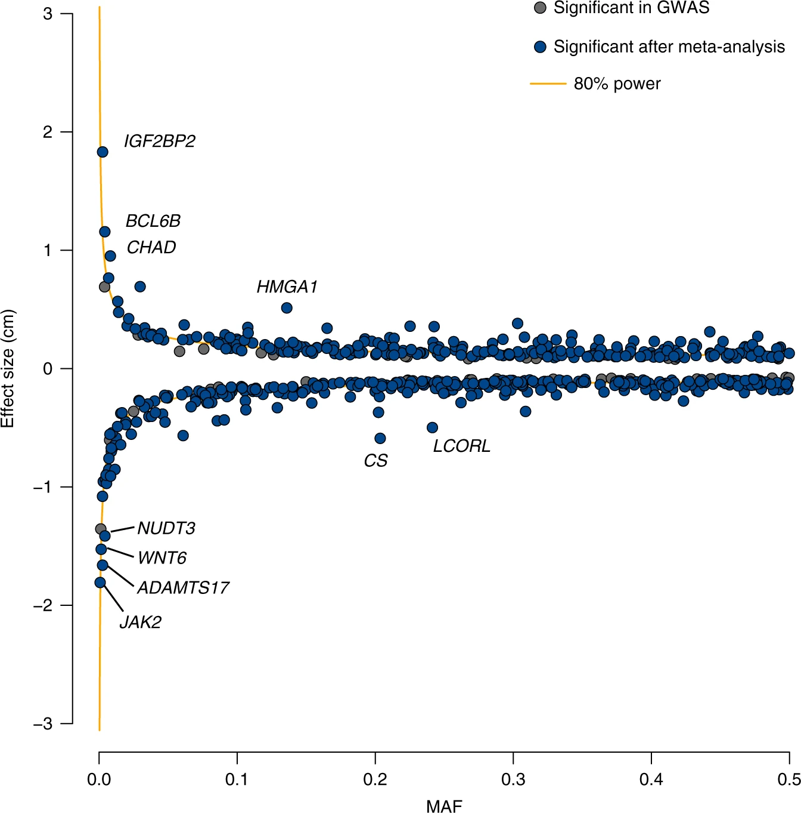

# 7.6 Power to detect associations

In previous sections, we described how in GWAS, we test each variant individually for association with a trait, and for each we record an effect size (or odds ratio for a case-control trait) as well as a p-value testing the null hypothesis that the variant has no association with the trait. To reach "genome-wide significance", we required a variant to have a p-value below the accepted threshold of $5 \times 10^{-8}$. 

You can imagine that the ability of a variant to reach that threshold might depend on a number of factors. For example, if a variant has a very strong effect on disease risk, it might reach a stronger p-value and be more likely to show up as significant compared to a variant with a very weak effect. 

Here we will consider the concept of *power*, which in GWAS is the probability that we can detect an association at the desired significance threshold, given there actually is a true association with the trait.

## 7.6.1 Review of the standard linear model for GWAS

Recall our original linear model we used for quantitative traits. Note we'll ignore the impact of covariates for now.

$$
Y = \beta_j X_j + \epsilon_j
$$

where:

* $Y=\{y_1, ..., y_n\}$ is a vector of phenotypes for each of our $n$ samples. (This is often scaled to have mean 0 and variance 1).
* $X_j=\{x_{j1}, ..., x_{jn}\}$ is a vector of genotypes for SNP $j$ (0s, 1s, and 2s).
* $\beta_j$ is the effect size for SNP $j$ (this is just a scalar value).
* $\epsilon_j=\{\epsilon_{j1}..., \epsilon_{jn}\}$ is a vector of noise terms for each sample, where $\epsilon_{ij} \sim N(0, \sigma^2_j)$, where $\sigma^2_j$.

Note, if $Y$ is normalized such that it has variance equal to 1, and we assume the genotype and noise terms are independent (no covariance), we can determine what percent of variation in the trait is determined by our SNP (the $\beta_j X_j$ term) vs. other factors (the noise term $\epsilon_j$):

* Percent of variance explained by SNP $j$: $Var(\beta_j X_j) = \beta_j^2Var(X_j)$
* Percent of variance explained by other factors: $\sigma^2_j = 1-\beta_j^2Var(X_j)$

Another side note: if genotypes had also been scaled to have variance 1, then $\beta_j^2$ would directly give us the percentage of variance explained by SNP $j$. It would also be equivalent to the Pearson $r^2$ between $X_j$ and $Y$ since $corr(Y, X_j) = \frac{cov(Y, X_j)}{Var(Y)Var(X_j)} = cov(Y,X_j)$ and the least squares estimate of $\beta_j$ is $\hat{\beta_j} = \frac{cov(Y,X_j)}{Var(X_j)}$.

## 7.6.2 GWAS power considerations

As stated above, *power* describes the probability we will correctly reject the null hypothesis (here, $\beta_j=0$) when in fact there is a real association. Power will depend on three key properties:

* **Effect size ($\beta$)**: the bigger effect a variant has on our trait, the easier it will be to detect. As we saw above, the effect size is related to the variance in the phenotype that can be attributed to the SNP we are testing.

* **Allele frequency**: Associations with rarer alleles will be harder to find than those with common alleles. As we also saw above, the variance explained by the SNP is also a function of $Var(X_j)$. If the SNP is very rare, $Var(X_j)$ will be small.

* **Sample size**: The bigger the sample size, the easier ti will be to detect effects of a given size. This is the main reason GWAS cohorts need to be so big. The majority of common variants impacting complex traits have modest effect sizes, and therefore require massive sample sizes to detect.

## 7.6.3 Computing power - simulations

One way we can estimate power is through simulations (similar to how we previously used simulations to estimate p-values).

If we have a way to simulate true associations under specific settings (sample size, minor allele frequency, effect size), we can simulate a bunch of datasets under those settings, perform our association test, and ask what percentage of the time we can detect a significant association. For example if we perform 100 simulations and 50% of those end up with association p-values $<5 \times 10^{-8}$, we can estimate our power to be 50%. 


## 7.6.4 Computing power - analytically

There is a closed form solution to compute the power to detect an association. Let $H2$ be the variance explained by a SNP $j$ with effect size $\beta_j$ and minor allele frequency $p_i$.

$$
H2 = \beta_j^2*2*p_j*(1-p_j)
$$

Note: this uses the fact that the genotype variance is $Var(X_j)=2p_j(1-p_j)$ (see below).

Now assume we would like to achieve a significance threshold of $\alpha$ (typically $\alpha=5 \times 10^{-8})$, and that we have a sample size of $N$ people. We can compute the power in Python using:

```
threshold = scipy.stats.chi2.ppf(1-alpha, 1)
power = 1-scipy.stats.ncx2.cdf(threshold , 1, (N*H2))
```

(Source: https://genome.sph.umich.edu/wiki/Power_Calculations:_Quantitative_Traits)

We did not derive this here, but this formula shows that power directly depends on the quantity $N \times H2$. 

Note, with a large enough simulations, you would find that the simulation method and the analytical method described above should give very similar results:


The x-axis gives the sample size and the y-axis gives the power to detect associations under different minor allele frequency ($f$) and effect size ($B$) settings. Sim=simulations, Comp=analytical solution. 

## 7.6.4 Power curves

For a given sample size $N$, we can visualize the range of effects we can hope to capture at a certain power threshold (e.g. 80%). Below shows an example:



Source: https://www.nature.com/articles/s41467-019-12276-5/figures/2

The x-axis gives minor allele frequency and the y-axis gives effect size. The blue dots represent GWAS signals and the yellow lines represent the range of effects that can be detected at this sample size at 80% power. As expected, few points fall inside of the yellow lines.

## 7.6.5 Appendix: mean and variance of genotypes for a single SNP

Let $X$ be a vector of SNP genotypes at a single SNP with minor allele frequency $p$.

Then we can get the mean:

$$
Mean(X) = \sum_{g\in \{0, 1, 2\}} g\times p(g) = 0(1-p)^2 + 1(2p(1-p)) + 2(p^2) = 2p-2p^2+2p^2 = 2p
$$

Note here $p(g)$ is based on genotype frequencies for 0, 1, or 2 copies of the alternate allele based on Hardy Weinberg Equilibrium.

We can similarly compute the variance:

$$
Var(X) = \sum_g p(g)(g-Mean(X))^2 = (1-p)^2(0-2p)^2 + 2p(1-p)(1-2p)^2+p^2(2-2p)^2
$$

Let's take out a $(1-p)$ from each term and expand some things:

$$
Var(X) = (1-p)[(1-p)4p^2 + 2p(1-2p)^2 + 4p^2(1-p)]
$$

Simplifying:

$$
Var(X) = (1-p)[8p^2(1-p)+2p(1-2p)^2] = (1-p)[8p^2-8p^3 + 2p-8p^2 + 8p^3] = (1-p)2p
$$

which matches the $Var(X)=2p(1-p)$ we used above!