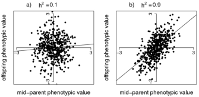

# 8.1 Measuring heritability in related individuals

In this section we will explore several ways to measure heritability in pedigrees (related individuals).

## 8.1.1 Midparent regression

A classical way to measure heritabilitly of a trait is the midparent method. This method fits the following linear equation:

$$
Y_{child} = \beta Y_{mid} + \epsilon
$$

where:

* $Y_{child}$ is the phenotype of the child
* $Y_{mid}=\frac{Y_{mother}+Y_{father}}{2}$ is the average of the two parent phenotypes ("midparent")
* $\beta$ is the slope of the best fit line
* $\epsilon$ is the error term

Note we are ignoring covariates like sex here. If this were height for example, we'd need to adjust the phenotypes for covariates first.

Using this method, the slope, $\beta$ gives an estimate of the heritability. Intuitively, if the slope is close to 1, the trait is completely heritable, and we'd expect the child's phenotype to be around the average of the two parent values. If heritability is 0, there is no relationship between the child and parent phenotypes. See the example data below:

Source: [Nature Education - Estimating Trait Heritability](https://www.nature.com/scitable/topicpage/estimating-trait-heritability-46889)

Note, even when the heritability is 1, there will still be some variation of the points along the x=y diagonal. Even in this case the child's phenotype is not completely deterministic: it will depend which half of each parent's genome they inherit and so there will be some variance. 

To help illustrate this, consider the correlation between $Y_{child}$ and $Y_{mid}$:

$$
Cor(Y_{child}, Y_{mid}) = \frac{cov(Y_{child}, Y_{mid})}{\sigma(Y_{child})\sigma(Y_{mid})}
$$

where $\sigma(Y)$ gives the standard deviation. We can assume the variance of $Y_{child}$ is similar to that of $Y_{mother}$ and $Y_{father}$ (all just reflect the variance of the phenotype in the population.) Therefore:

$$
Var(Y_{mid}) = Var(\frac{Y_{mother}+Y_{father}}{2}) = 2Var(\frac{Y_{child}}{2}) = \frac{1}{2}Var(Y_{child})
$$

We assumed there is no covariance between $Y_{mother}$ and $Y_{father}$ and also used the common relationship $Var(aX)=a^2Var(X)$. We can also write down the least squares estimate of $\beta$:

$$
\beta = h^2 = \frac{cov(Y_{child}), Y_{mid}}{Var(Y_{mid})} = \frac{2cov(Y_{child}), Y_{mid}}{Var(Y_{child})} 
$$

Rearraing the above equation for the correlation and substituting our expressions for $\beta$ and $Var(Y_{child})$ gives:

$$
Cor(Y_{child}, Y_{mid}) = \frac{cov(Y_{child}, Y_{mid})}{\sigma(Y_{child})\sigma(Y_{mid})} =  \frac{cov(Y_{child}, Y_{mid})}{\sqrt{2}Var(Y_{mid})} = \sqrt{\frac{1}{2}}h^2
$$

And so, even if the heritability is 1, the correlation bewteen the values will be less than 1 (0.71).

## 8.1.2 Twin studies

The midparent method isn't perfect. It will tend to over-estimate heritability, since there is likely a lot of shared environmental factors between parents and children. A second study design we could use to estimate heritability is by looking at identical twins, which attempts to account for this.

Consider that you collected phenotypes for many sets of monozygotic (MZ) twins. We could attribute to the correlation of phenotypes between them as being due to both their shared genomes (100%) and their shared environment:

$$
r_{MZ} = V_G + V_E
$$

Now we can also collect data for a set of dizygotic (DZ) twins. DZ twins are together *in utero*, but genetically are the same as siblings. That is, they are expected to share around half of their genomes (remember, this is an average). However, they are still expected to share a similar amount of their environments as do MZ twins. So we can write:

$$
r_{DZ} = \frac{1}{2}V_G + V_E
$$

Now we can rearrange to get:
$$
2(r_{MZ}-r_{DZ}) = 2V_G+2V_E-V_G-2V_E = V_G
$$

this is known as *Falconer's* method to estimate heritability from twin studies as:

$$
h^2 = 2(r_{MZ}-r_{DZ}) 
$$

This does better by accounting for shared environment. However, it also makes the simplifying assumption that DZ twins share half their genomes. In reality, there will be a distribution of sharing. Also, it's possible that MZ twins actually do share more environmental factors, if they are treated more similarly than DZ twins might be.

## 8.1.3 Sibling pairs - Haseman Elston regression

Let's look at one more method to measure heritability, this time in siblings. As mentioned above, siblings will share on average 50% of their genomes, but there is a distribution: some share more, some share less. *Haseman-Elston* (HE) regression looks at the values of phenotypes for pairs of siblings. Intuitively, siblings who happen to share more of their genomes IBD should have more similar phenotypes than those who happen to share less. We can use the following regression to data from many pairs of siblings:

$$
(Y_{i1}-Y_{i2})^2 = \alpha + \beta \pi_{i} + \epsilon
$$

where $Y_{i1}$ and $Y_{i2}$ are the phenotype values for sibling pair $i$ and $\pi_{i}$ is the IBD sharing between the sibling pair. This line is expected to have a negative slope: if IBD is large, the phenotype difference is expected to be small, and vice versa. It turns out that the slope of this line gives us yet another way to estimate heritability:

$$
h^2 = -\frac{\beta}{2}
$$

This is actually related to Falconer's formula above. We can write:

$$
E[Corr(Y_{i1}, Y_{i2})] = \frac{Cov(Y_{i1},Y_{i2})}{Var(Y_{i1})Var(Y_{i2})}
$$

Let's assume we have standardized the phenotypes to have mean 0 and variance 1. Then the covariance is the same as the correlation and we can write:

$$
E[Corr(Y_{i1}, Y_{i2})] = E[Y_{i1}Y_{i2}]-E[Y_{i1}]E[Y_{i2}] = E[Y_{i1}Y_{i2}]
$$

Now back to the HE-regression equation. We can expand the left-hand side:

$$
E[(Y_{i1}-Y_{i2})^2] = E[Y_{i1}^2] + E[Y_{i2}^2] - 2E[Y_{i1}Y_{i2}] = 2Var(Y_{i1}) - 2E[Y_{i1}Y_{i2}] = 2 - 2E[Y_{i1}Y_{i2}]
$$

(since the variance of $Y_{i1}$ and $Y_{i2}$ are the same, and $E[Y^2]=Var(Y)-E[Y]^2=1-0 = 1$). We can rearrange the HE-regression formula to instead regress on the product of sibling phenotype values:

$$
Y_{i1}Y_{i2} = \alpha - \frac{\beta}{2} \pi_{i} + \epsilon
$$

(Note the constant 2 just got absorbed into the $\alpha$ intercept term and we can ignore it.) Now we can see the parallel to the formula we used for $r_{DZ}$ above:

$$
r_{DZ} = \frac{1}{2}V_G + V_E
$$

$$
E[r_{i}] = E[Y_{i1}Y_{i2}] = \pi_{i} (- \frac{\beta}{2}) + \epsilon
$$

Parallels:
* For twin studies, we measured the correlation $r_{DZ}$. For HE regression, we measured $(Y_{i1}-Y_{i2})^2$, which we rearranged here to be related to the *expected correlation* between sibs.
* For twin studies, we just set the IBD ($\pi$) term to 0.5. Here we instead have $\pi_{i}$ is the actual measured IBD between sib pair $i$.
* The $V_G$ term from the twin equation, which turned out to be equal to the heritability estimate, turned into $-\frac{\beta}{2}$ here.
* The $V_E$ term from the twin equation is just our $\epsilon$ here.

This matches up with what we stated above, which is that $-\frac{\beta}{2}$ is another estimate of heritability.

## 8.1.4 Note on alternative way to do HE

Note: we could have also just regressed the product of sibling phenotype values in the first place on IBD:

$$
Y_{i1}Y_{i2} = \alpha + \beta\pi_{i} + \epsilon
$$

In this case, $\beta$ directly gives us the estimate of $h^2$. This alternate formulation appears to be a bit more commonly used than the squared difference of phenotypes way presented above.
