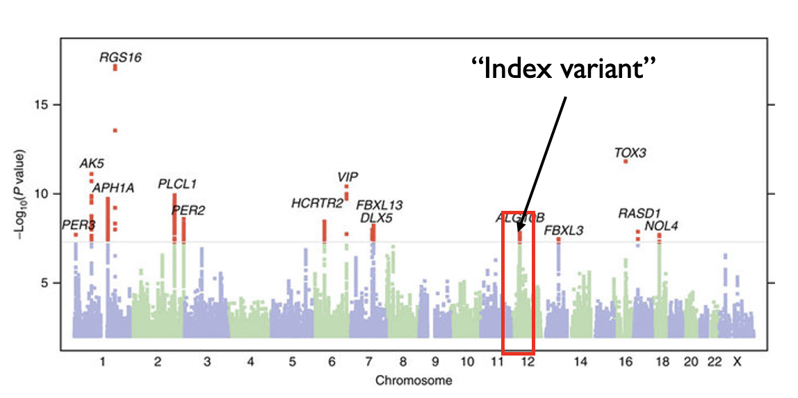

# 9.1 Clumping + Threshold (C+T) method

Here we will discuss the "clumping + thresholding" (C+T) method for constructing a PRS. You may also see this referred to in the literature as "pruning + thresholding" (P+T).

## 9.1.1 Overview
When introducing polygenic risk scores discussed they would often take the form of a weighted sum of SNP genotypes below:

$$
PRS_i = \sum_{j \in S} w_j X_{ij}
$$

We have two things to figure out for our scores:

* What to set the weights $w_j$ to?
* Which set of SNPs $S$ should we use for our score?

For the weights, we will just use the effect sizes ($\beta_j$'s) for each SNP that we learned when doing GWAS. Thus the main thing we'll have to figure out for the C+T method is *which SNPs* to include.

Note: If the PRS is for a quantitative trait that had been scaled to have mean 0 variance 1 before, we can interpret the PRS as giving the number of standard deviations away from the mean in the population a person's risk is. If this was for a case-control, we'd simply use the $\beta_j$ values from the logistic regression instead, and the PRS could be interpreted as a log odds of disease.

## 9.1.2 Which SNPs to include in our PRS?

Let's consider several possible sets of SNPs to include in our PRS.

One option could be to include *all SNPs* that were analyzed in a GWAS for the trait. However, this is not a great choice since the majority of SNPs likely have a true effect size of 0, so this would be adding a lot of noise. Also, we know from previous discussions that many SNPs are in strong LD with each other. If we had $n$ SNPs all in perfect LD, we'd be counting their effects $n$ times even though they likely do not contribute independently to the trait.

A second option might be to consider only *significant* SNPs from our GWAS, i.e. those passing the genome-wide significance threshold of $P<5 \times 10^{-8}$. However we still have several problems. First, as discussed at the end of the GWAS chapter, we often do not have perfect power to detect true associations. There are likely a lot of informative associations that would help our PRS but did not reach the genome-wide significance threshold. Second, we still haven't dealt with the LD problem.

A third option could be to consider only SNPs that passed some *other*, possibly more lenient, p-value threshold $T$ in the original GWAS (we'll have to figure out that threshold though). Then, to deal with the LD double counting issue, we could only take SNPs from that set that are not in strong LD with each other to make sure each SNP in our final PRS is mostly independent.

This third option (LD-independent SNPs passing some p-value threshold $T$) will form the basis of the SNPs we choose for the C+T method we'll put together.

## 9.1.3 LD clumping

Before proceeding, we will discuss how to "clump" SNPs from a GWAS to get mostly independent SNPs to use in our score. Recall from our GWAS discussion that we would often see "skyscrapers" in which many SNPs in strong LD would all be associated with a trait.

Modified from: https://www.nature.com/articles/ncomms10448

The goal of clumping is to identify groups, or clumps, of SNPs that all represent a single signal. We use the top (best p-value) SNP in a clump as its representative, which is often referred to as the *index variant* or *lead variant* of a signal.

An outline of a possible method for performing clumping is:
1. Identify the top variant of a GWAS (best p-value) and use it to form a clump.
2. Find all other variants that are both: (1) within some distance window (e.g. 250kb) of the top variant and (2) in some minimum LD (e.g. $r^2<0.1$ with the top variant). Assign those to the same clump as the lead variant.
3. Remove SNPs assigned to that clump and repeat steps 1-2 until no variants remain with a p-value below some threshold.

In practice, clumping can be performed using the plink `--clump` option. 

Note, some regions will have multiple independent signals. Therefore it's possible what appears as a single skyscraper on a Manhattan plot will actually correspond to multiple clumps.

The output of clumping will be a list of clumps, along with the lead variant, its p-value, and a list of other SNPs assigned to the same clump.

## 9.1.4 Evaluating a PRS

Before we get to make our final score, we need to mention how we will evaluate the performance of a PRS. We will talk more about this later but the main metrics used are:

1. For quantitative traits: we can take the Pearson correlation between $PRS_i$ and $Y_i$ for each sample. That is, we can check how correlated the polygenic risk scores are with the real phenotype values.

2. For case-control traits: we can treat this as a classification problem and compute the area under the receive operator curve (auROC), a classical method for evaluating classifier performance in machine learning.

## 9.1.5 Putting it all together - C+T

Now we can construct our score as follows:

1. *Perform a GWAS* to get the weights ($\beta_j$) for each SNP. You may alternatively obtain the weights from a previously published GWAS done in a different cohort (of similar ancestry).

2. *Perform LD-clumping* to get an independent set of SNPs

3. *Choose all clumps with p-value $<T$*

4. *Compute PRS accuracy*, either $r^2$ or auROC.

5. *Repeat steps 2-4* using a range of different values for the p-value threshold $T$ as well as the clumping parameters (e.g. LD threshold).

6. Determine the parameters that gave you the best PRS from step 5. That is your final PRS.

7. Test the final PRS in a separate test dataset to get a final measure of its accuracy.

So, the key here is we do not know the best values for the p-value threshold or clumping parameters, so we just try a bunch of them and find which gives us the best performance. The best values will be different on different datasets.

## 9.1.6 Summary of cohorts needed for constructing a PRS

The steps above generally require three different cohorts:

1. The *training* (GWAS) cohort: this is typically by far the largest cohort. It is used to learn the weights for each SNP by doing GWAS. THe more samples, the more accurate our weight estimates will be, and therefore the more accurate our score will be.

2. The *validation* cohort: this is the cohort used to tune the parameters ($T$ and clumping parameters). It is important that this cohort has similar ancestry to the GWAS cohort used to learn the weights.

3. The *test* cohort: this is held out of all training and tuning steps, and is used to evaluate the accuracy of the final score.

## 9.1.7 Running C+T in practice

All steps of C+T can be performed using plink, but you'll have to stitch together different commands for each of the steps. Alternatively tools such as [PRSice2](https://choishingwan.github.io/PRSice/) will automate some of the steps.
